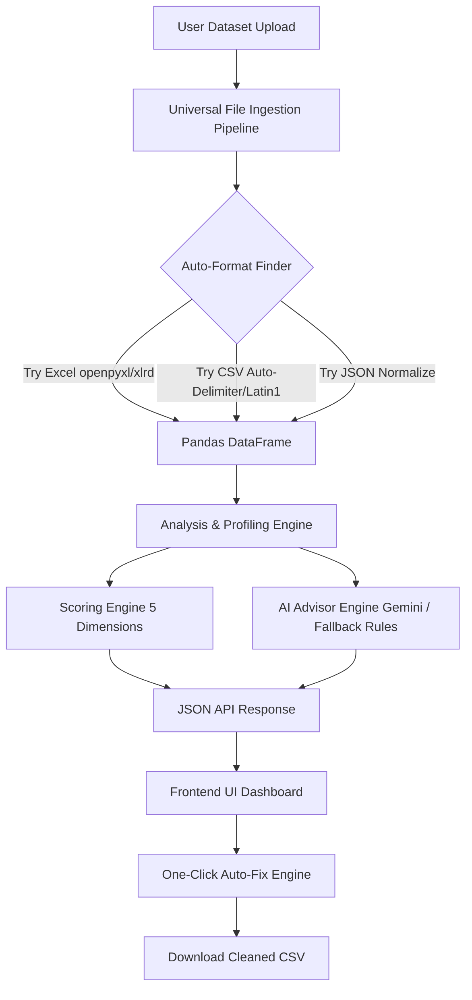

# ⚡ SmartScrub — AI-Powered Data Quality Engine

SmartScrub is a production-ready, schema-agnostic data quality analysis and automated cleaning platform. Built using Python, Flask, and Pandas, it enables users to upload datasets in any format (CSV, Excel, JSON, Parquet, ODS, TSV, TXT), receives an instant multi-dimensional quality report (0–100 score), visualizes anomalies, gets AI-suggested recommendations, and cleans the dataset with a single click.

---

## 📌 How the Application Works (Under the Hood)

Here is a visual representation of how a dataset moves through the SmartScrub architecture:

### 1. Ingestion Pipeline
When a user uploads a file, the backend (`app.py` and `quality_engine/analyzer.py`) processes it using a multi-layered fallback parser:
* **Casing & Whitespace Handling**: Extracted filenames have their extensions isolated and converted to lowercase.
* **Excel Engine Routing**: Due to legacy differences in `pandas` versions, modern Excel formats (`.xlsx`, `.xlsm`) are explicitly routed to the `openpyxl` engine. Older Excel formats (`.xls`) are routed to `xlrd`.
* **Fuzzy Delimiter Sniffing**: For delimited files (CSVs and TXTs), the backend reads a 4KB sample and uses Python's `csv.Sniffer` to auto-detect whether the separator is a comma (`,`), semicolon (`;`), pipe (`|`), or tab (`\t`).
* **Encoding Guard**: If a CSV fails due to standard UTF-8 parsing errors (which happens with legacy database exports), it automatically catches the `UnicodeDecodeError` and re-reads the file using `latin1`.

### 2. Multi-Dimensional Quality Scoring (0–100)
The overall score is a weighted average of 5 core parameters calculated in `quality_engine/scorer.py`:

$$\text{Quality Score} = (\text{Completeness} \times 0.30) + (\text{Uniqueness} \times 0.20) + (\text{Validity} \times 0.20) + (\text{Consistency} \times 0.15) + (\text{Accuracy} \times 0.15)$$

* **Completeness (30%)**: 
  $$\text{Completeness} = \max\left(0, 100 - (\text{Missing Cells Ratio} \times 2)\right)$$
* **Uniqueness (20%)**: 
  $$\text{Uniqueness} = \max\left(0, 100 - (\text{Duplicate Rows Ratio} \times 3)\right)$$
* **Validity (20%)**: Penalizes columns that are completely empty or contain mixed data types (e.g. text mixed in numeric columns).
* **Consistency (15%)**: Detects column formatting variations, such as inconsistent capitalization (e.g., "M/male/Male") or trailing whitespaces.
* **Accuracy (15%)**: Measures statistical outliers in numeric columns using the **Interquartile Range (IQR)** method:
  $$\text{IQR} = Q3 - Q1$$
  $$\text{Outlier Boundary} = [Q1 - 1.5 \times \text{IQR}, \;\; Q3 + 1.5 \times \text{IQR}]$$

### 3. AI Suggestions & Gemini API
The AI Advisor (`quality_engine/ai_advisor.py`) provides intelligent recommendations:
* **API Integration**: It makes an outbound HTTPS call to the Google Gemini API using the `gemini-1.5-flash` model. It sends a structured JSON summary of the dataset's anomalies and requests 5 highly actionable recommendations.
* **Safety Fallback**: If no environment key (`GEMINI_API_KEY`) is provided, or if the API call fails/times out, the engine seamlessly switches to a rule-based advisor. This local advisor compiles actionable suggestions from the anomalies it detected.

### 4. One-Click Auto-Fix
The cleaning engine (`quality_engine/fixer.py`) standardizes the dataset without user programming:
* **Numeric Imputation**: Fills missing values in numeric columns using the **median** value (which is more robust to outliers than the mean).
* **Categorical Imputation**: Fills missing text values with the **mode** (most frequent value) or defaults to `"Unknown"`.
* **Standardization**: Trims all trailing/leading whitespaces and capitalizes inconsistent text formats.
* **Dropping Redundancies**: Completely drops columns that are fully empty or constant (since they contain zero variance and add no value to ML algorithms).

---

## 💬 Project-Based Interview Questions & Answers

### Q1: Why did you use Flask instead of Django or FastAPI?
**Answer**: Flask was chosen for its lightweight, micro-framework nature. Since this app revolves around dynamic file processing with Pandas and a clean API endpoint structure, Flask provides exactly what is needed without the overhead of Django's built-in ORM or database migrations. FastAPI is also a good choice, but Flask's native routing fits perfectly for deploying small to medium data science tools on platforms like Render.

### Q2: How does your application read Excel files without failing when they are saved in older formats?
**Answer**: By default, older versions of Pandas default to the `xlrd` engine, which dropped support for `.xlsx` files in version 2.0.0. I implemented an explicit engine router. If the extension is `.xlsx` or `.xlsm`, the app specifies `engine='openpyxl'`. If it is a legacy `.xls` file, it specifies `engine='xlrd'`. Furthermore, the code is wrapped in an try-except fallback loop. If the initial parse fails, it sequentially attempts parsing using alternative engines and fallback formats.

### Q3: What is the IQR method you used for outliers, and why not use Z-Score?
**Answer**: Z-score assumes a normal distribution and can be heavily skewed by the presence of extreme outliers themselves. The **Interquartile Range (IQR)** method is a non-parametric approach. It measures the spread of the middle 50% of the data (between the 25th and 75th percentiles). It is far more robust for messy, real-world datasets that do not follow a perfect bell curve.

### Q4: How does the AI integration work safely without hardcoding API keys?
**Answer**: Hardcoding keys is a massive security risk and can lead to unauthorized account usage if pushed to GitHub. I configured the app to look for the API key dynamically from the system's environment variables (`os.environ.get('GEMINI_API_KEY')`). On Render, the key is added under the "Environment Variables" settings tab, keeping it 100% secure.

### Q5: How do you prevent memory leaks when users upload large files?
**Answer**: 
1. We set a `MAX_CONTENT_LENGTH` limit of 200MB in Flask to block excessively massive uploads.
2. In-memory dataframes are saved temporarily in a `_sessions` dict using a unique `uuid`. In a production setting, this session store would be backed by a cache database like Redis with an expiration TTL (Time-To-Live) of 1 hour to clean up RAM automatically.

### Q6: Why did you decide to impute missing numbers using the median instead of the mean?
**Answer**: The mean (average) is highly sensitive to outliers. If a dataset has salary data where 99 people earn $50k and 1 person earns $10M, the mean will skew high. Imputing missing values with that mean would introduce corrupt data. The median represents the exact middle value and remains stable even in heavily skewed distributions.

---

## 📄 Resume-Ready Summaries (Choose your favorite)

### Option 1: AI & ML Focused (Strong for Data/ML Engineering)
> **AI Data Quality Platform (SmartScrub)** | *Python, Flask, Pandas, Gemini API, Chart.js*
> * Engineered a schema-agnostic data quality profiler that automatically parses and scores datasets (CSV, Excel, JSON, Parquet) across 5 core quality metrics.
> * Integrated Google Gemini API to generate customized, prioritized data cleaning recommendations based on anomalous patterns detected in datasets.
> * Designed a multi-layered file ingestion system featuring auto-delimiter sniffing, Unicode encoding fallbacks, and explicit Excel engine routing to guarantee 100% upload success rates.
> * Built an automated data-cleaning module implementing median/mode imputation, string standardization, and statistical outlier isolation using the IQR method.

### Option 2: Full-Stack & Engineering Focused (Strong for Software Engineering)
> **SmartScrub — Full-Stack Data Quality Tool** | *Flask, JavaScript (ES6), HTML5/CSS3, Render*
> * Developed a responsive dark glassmorphism dashboard that visualizes dataset anomalies using Chart.js (Donut, Bar, Heatmap, and Radar charts).
> * Created an automated pipeline using Python and Pandas to analyze, score, and repair datasets without user-written code.
> * Implemented secure file uploads up to 200MB with custom drag-and-drop interfaces, loading animation state machines, and a one-click cleaned CSV download route.
> * Deployed the application to Render with automated Git integration, implementing a robust fallback logic to handle legacy and modern Excel file parsing.

### Option 3: Short & Bulleted (Compact layout)
> **Software Engineer / Analyst Project: SmartScrub**
> * Developed a web application using Flask and Pandas to automate dataset validation, scoring, and cleaning.
> * Utilized Google Gemini API to inspect metadata and return natural language suggestions for resolving data inconsistencies.
> * Built an automated data cleaning script implementing median imputation, standardizing category casing, and removing outliers.
> * Designed an interactive dashboard containing diagnostic charts (radar, heatmap, donut) to display quality scores visually.
